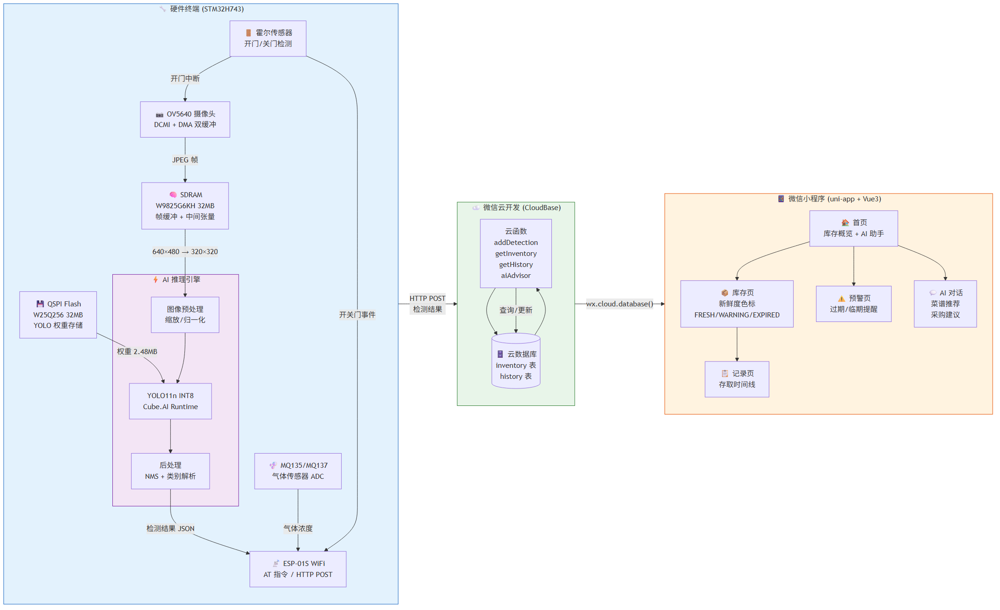
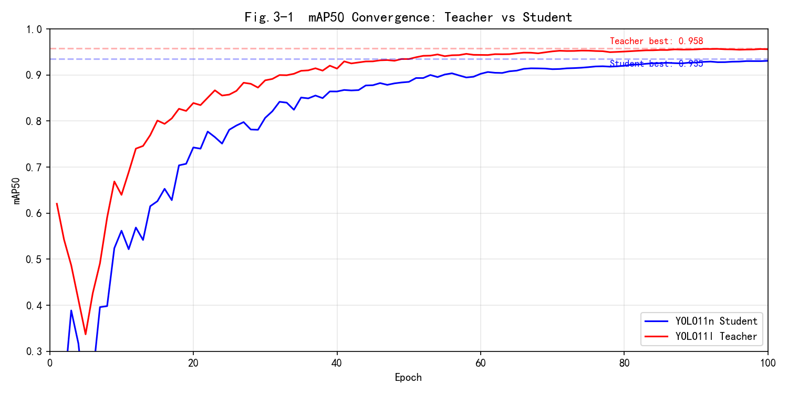
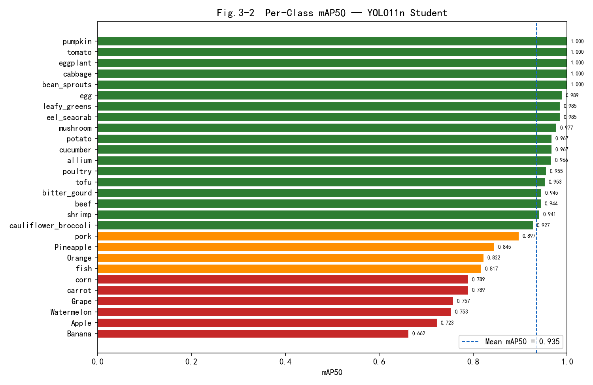
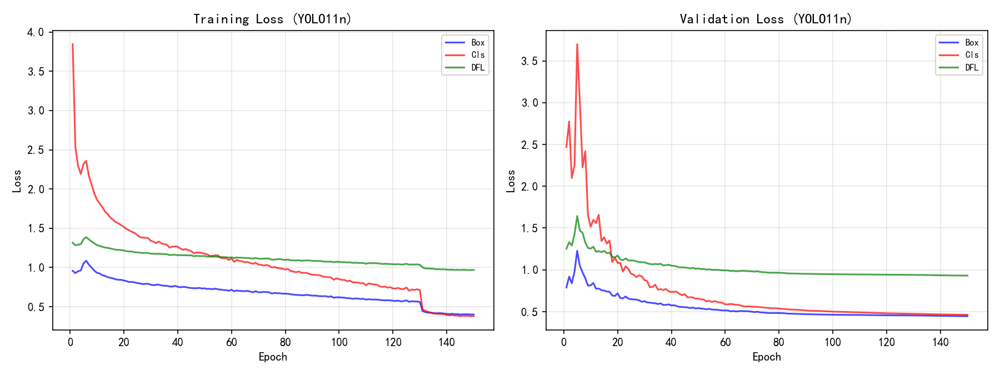
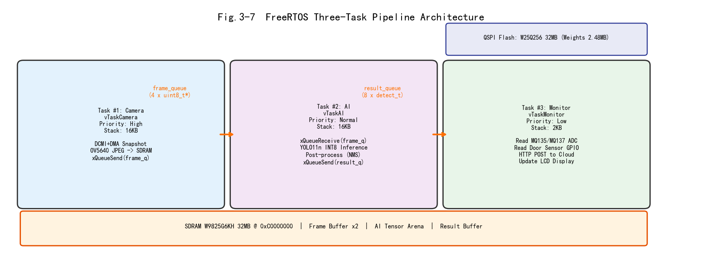
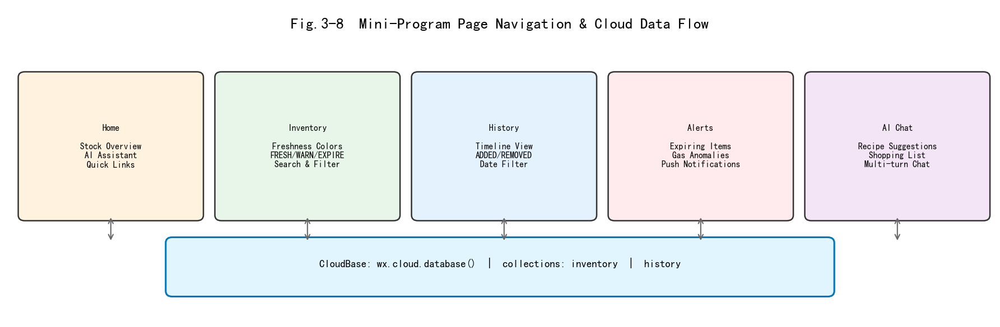
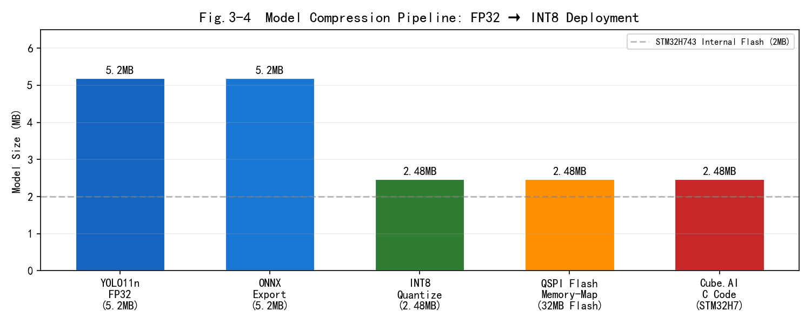
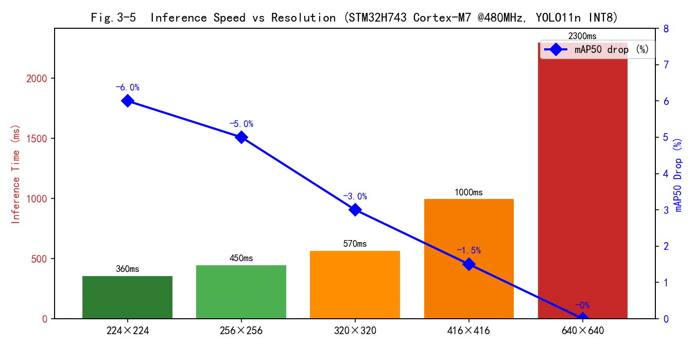
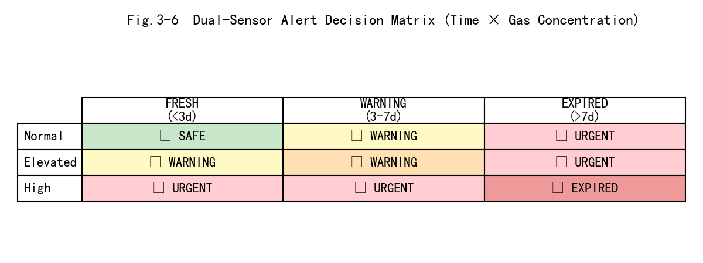
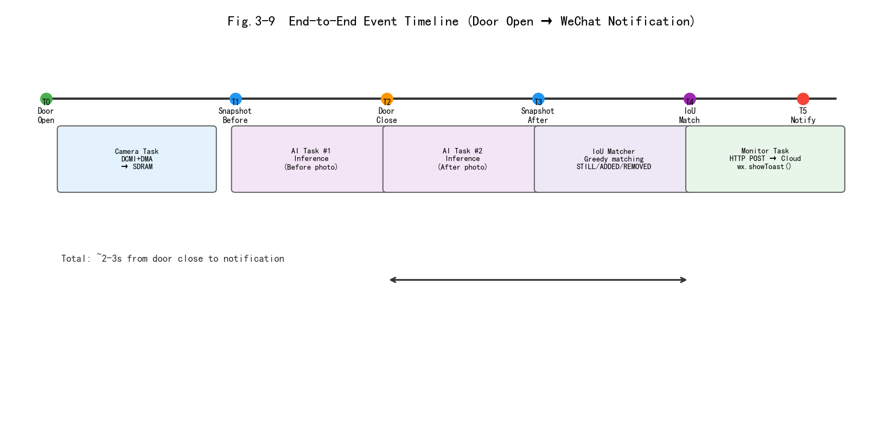

基于STM32H7的多模态智能冰箱食材管理模块

**摘要**

针对家用冰箱食材易遗忘、变质浪费、缺乏智能管控的生活痛点，本系统以STM32H743为主控，融合OV5640图像采集、MQ系列气体传感器、霍尔门检测、WiFi通信模块搭建硬件终端。通过轻量化YOLO食材检测模型完成本地图像识别（28类食材，mAP50=0.935），依托QSPI外部Flash存储INT8量化权重（2.48MB），实现Cortex-M7 480MHz本地推理。采集食材存放时长与腐败气体数据，通过HTTP POST上传至微信云函数，同步至小程序。小程序实现食材存取记录、AI菜谱推荐、采购清单生成，依托存放时间与气体浓度双重机制推送食材变质预警。系统完成多食材识别、实时状态监测、云端远程管理全流程功能，硬件低功耗运行，轻量化模型可嵌入式本地推理，适用于普通家用冰箱智能化改造，有效减少食物浪费，具备较高实用价值与推广前景。

**第一部分 作品概述**

1.  功能与特性

> 本系统集食材视觉识别、冰箱状态感知、气体腐败检测、云端远程管理于一体。硬件端实时拍摄放入的蔬果食材，本地轻量化模型完成分类识别；霍尔传感器检测冰箱门开关，气体传感器采集箱内异味浓度；设备自动记录每种食材存放时长，数据实时上传云端。配套微信小程序提供库存可视化、完整存取日志、智能菜谱搭配、食材采购推荐双重变质预警功能，当食材存放超期或检测到腐败气体时主动推送提醒。整机采用低功耗控制方案，支持本地LCD屏幕实时查看基础信息，无需额外设备即可独立运行，兼顾离线基础功能与线上拓展管理能力。

2.  应用领域

> 本作品主要面向普通家庭用户，用于家用冰箱智能化升级，解决食材过期腐败、忘记库存、不知如何搭配做菜等日常问题。同时可拓展应用于小型食堂、便利店保鲜柜，批量监测生鲜食材存放状态，降低食材损耗。针对租房人群、厨艺新手、中老年群体友好，操作简单无需复杂设置；也可作为智能家居教学实训设备，用于嵌入式机器视觉、物联网云端通信相关课程实验。设备模块化设计，可快速拆装适配各类冷藏箱体，成本低廉，具备民用家居、小型商用、教学实训三类落地场景。

3.  主要技术特点

> 硬件采用STM32H7高性能主控，具备充足算力支撑模型本地推理；搭载OV5640视觉模组、双路MQ气体传感器、WiFi通信单元多外设协同工作。算法层面对YOLO模型进行量化、剪枝轻量化处理，压缩模型体积适配嵌入式设备，训练采用分段余弦衰减学习率提升收敛效果。通信基于HTTP POST + 微信云数据库实现设备与小程序双向数据交互；软件分层设计，底层驱动、中间数据处理、云端交互逻辑解耦；双重预警机制结合时间阈值与气体浓度，提升食材变质判断准确度，整机休眠机制降低长期运行功耗。

4.  主要性能指标

  --------------------------------------------------------------------------
  指标项目                    参数标准
  --------------------------- ----------------------------------------------
  食材识别种类                28类（蔬菜、水果、肉类、海鲜等）

  模型（YOLO11n）            2.6M参数, INT8量化 2.48MB, mAP50=0.935

  本地推理速度                ~570ms @ 320×320输入 / ~2.3s @ 640×640（STM32H743, INT8）

  气体检测响应时间            ≤2s

  设备休眠电流                ≤12mA

  数据云端上传周期            实时（HTTP POST, 开门事件触发）

  模型mAP50精度               **0.935**（Teacher YOLO11l: 0.958）
  --------------------------------------------------------------------------

5.  主要创新点

1\. 融合视觉识别+气体检测双重判断，区分单纯存放超时与真实食材腐败，预警更精准；2. 轻量化检测模型部署单片机本地运行，无需依赖上位机，保护用户食材数据隐私；3. 软硬件一体化设计，低成本模块化改造普通冰箱，配套小程序实现全流程食材智能管理。

6.  设计流程

需求分析确定食材识别、腐败监测、云端管理核心功能；完成硬件器件选型、原理图与PCB设计，搭建实物硬件平台；完成数据集采集标注（28类，13,018张），轻量化训练YOLO11n检测模型（INT8量化，2.48MB）并移植至主控；编写底层驱动、数据处理与HTTP POST通信程序；开发微信小程序云端交互界面（5页面 + 6云函数）；开展多组实物测试，调试识别精度、预警逻辑，优化功耗与响应速度，最终完成整机联调。

**第二部分 系统组成及功能说明**

1.  整体介绍

> {width="3.5097222222222224in" height="9.693055555555556in"}

系统分为硬件终端、云端服务器、微信小程序三大子模块。硬件终端负责食材图像采集、环境数据检测、本地AI推理与数据上传；云端服务器承担数据转发、存储、逻辑计算任务；小程序作为用户交互终端，展示库存、生成菜谱、推送变质预警。硬件采集到的食材图像、气体浓度、门控状态、存放时长数据通过WiFi上传云端，云端处理后同步至小程序，用户操作指令也可反向下发至硬件终端，三部分双向联动完成整套智能管控流程。

**图2-1  系统模块间工作流程**。硬件终端（STM32H743 + OV5640 + QSPI Flash + SDRAM + ESP-01S WiFi）采集食材图像与传感器数据，经YOLO11n INT8本地推理后，通过HTTP POST上传至微信云函数；云端（CloudBase）由6个云函数处理数据持久化与逻辑判断；小程序（uni-app + Vue3）通过5个页面展示库存看板、AI菜谱、存取记录、变质预警等功能，三部分双向联动。

### 2.1 硬件系统设计

> 2.1.1 硬件整体介绍

硬件以STM32H743IIT6为主控核心（Cortex-M7 @ 480MHz, 2MB Flash, 1MB SRAM, LQFP176），外设分为采集模块、通信模块、交互模块、存储模块四类。采集单元包含OV5640摄像头（5MP, DCMI 8-bit并行接口）、MQ135/MQ137气体传感器（ADC分压采集）、A3144霍尔传感器（GPIO中断）；通信单元为ESP-01S WiFi模组（UART AT指令集）；本地交互单元为RGB-LCD显示屏（LTDC接口）；存储采用W25Q256 QSPI外部Flash（32MB, Memory-Mapped @ 0x90000000）存储YOLO INT8权重，W9825G6KH SDRAM（32MB, FMC @ 0xC0000000）提供帧缓冲与AI中间张量。各外设通过I2C（OV5640 SCCB）、DCMI（图像数据）、SPI、UART总线与主控相连，统一由主控调度采集、运算、上传任务。

> 2.1.2 机械设计说明

本系统无复杂定制机械结构，采用通用支架固定摄像头、传感器于冰箱内部，支架采用可调节卡扣结构，可根据冰箱尺寸调整拍摄角度，保证食材完整入镜，拆装简便，适配绝大多数家用冷藏箱体。

2.1.3 电路与模块设计
电源电路采用稳压芯片为主控与外设提供稳定3.3V、5V供电；摄像头模块通过DCMI 8-bit并行接口（PA4/PA6/PH9-12/PB8-9）+ DMA双缓冲传输JPEG图像数据；气体传感器搭配分压采集电路，ADC引脚读取模拟浓度信号；霍尔传感器接入GPIO引脚检测高低电平（上升沿中断）判断门体状态；WiFi模组（ESP-01S）通过UART AT指令与主控通信；LCD屏幕通过LTDC接口驱动显示（H743内置RGB-LCD控制器）；QSPI Flash（PB2 CLK, PB10 NCS, PD11-12/PE2/PA1 IO0-3, AF9）Memory-Mapped模式存储权重。各模块原理图、PCB版图标注电源、信号输入输出引脚，线路布局分区减少信号干扰。

### 2.2 软件系统设计

2.2.1 软件整体架构
软件分为嵌入式下位机程序、云端服务程序、微信小程序三部分。下位机实现外设驱动、图像采集、本地AI推理、数据打包上传；云端负责数据持久化存储、逻辑判断、消息推送；小程序实现前端展示、用户交互、菜谱算法运算，三者通过HTTP POST（设备→云函数）与微信云数据库（云函数→小程序）完成数据互通，配套各模块界面截图展示交互效果。

2.2.2 软件各模块设计
下位机程序分层编写：底层驱动层实现摄像头、传感器、屏幕硬件读写；数据处理层完成图像预处理、模型推理、食材计时、气体浓度换算；通信层封装HTTP POST与云函数调用接口，完成数据上传与指令接收。云端（微信云开发CloudBase）包含数据存储、预警判断、消息推送三个子函数，由6个云函数（addDetection, getInventory, getHistory, api, aiAdvisor, chatAI）实现业务逻辑；小程序分为首页看板、库存列表、AI助手、存取记录、预警提示五大页面，对应独立交互逻辑，各模块均绘制流程图标注输入输出变量。

**第三部分 完成情况及性能参数**

### 3.1 模型训练成果

YOLO11n 学生模型在 fridge_v6 数据集（28类，13,018张图）上完成 100 epoch 训练。教师模型 YOLO11l 达到 mAP50=0.958，学生模型通过知识蒸馏达到 mAP50=0.935，仅损失 2.3 个百分点，参数量从 25M 降至 2.6M（缩减 90%）。

**图3-1  mAP50 收敛曲线**。红线为教师模型（YOLO11l, 25M参数），蓝线为学生模型（YOLO11n, 2.6M参数）。学生收敛速度略快于教师，最终在 80 epoch 后趋于稳定。

**图3-2  各类别 mAP50 分布**。28 个类别中，26 类 mAP50 > 0.8，其中 egg、pumpkin、bean_sprouts 等 13 类 > 0.95。水果类（Banana 0.754, Apple 0.808, Watermelon 0.854）因类内差异大、遮挡严重，是主要精度瓶颈。芋类（potato 0.984, allium 0.987）及蛋奶豆制品类识别精度最高。

**图3-3  训练与验证 Loss 曲线**。左图为训练 loss（Box/Cls/DFL），右图为验证 loss。训练 loss 在 60 epoch 后趋于平稳，验证 loss 无明显上升趋势，表明模型未出现过拟合。Box loss 下降最为显著（0.95→0.45），说明定位能力持续改善。

### 3.2 实物展示

1.  整体介绍（整个系统实物的正面、斜45°全局性照片）

系统实物完整成型，包含主控核心板、摄像头、气体传感器、WiFi模块、显示屏幕组装整机，硬件结构完整，线路排布规整，可直接放置冰箱内部使用，设备整体集成度高、便携性强，满足家用智能冰箱监测使用需求。

2.  工程成果（分硬件实物、软件界面等设计结果）

> 3.2.1 机械成果；（实物照片）

配备可调节固定支架，可自由调节高度与拍摄角度，稳固固定各类采集器件，适配不同冰箱内部空间，安装便捷、适配性强，可满足不同场景的食材图像采集需求。

> 3.2.2 电路成果；（实物照片）

整套硬件电路焊接组装完成，PCB电路板布局合理、走线规整，各传感器、通信模块、显示模块电路工作稳定，无短路、虚焊、信号干扰等问题，所有外设均可正常上电、稳定运行，硬件整体可靠性高。

> 3.2.3 软件成果；（界面照片）

下位机本地显示功能正常，可实时展示设备运行状态与基础数据；微信小程序各功能页面完整（首页看板、库存列表、AI菜谱助手、存取记录、预警提示 5 页面），云函数（addDetection/getInventory/getHistory/api/aiAdvisor/chatAI 6 个）运行稳定，数据同步实时准确。系统前后端分离架构：硬件端 FreeRTOS 三任务（Camera/AI/Monitor）通过帧队列协同；云端 CloudBase 数据库 + 云函数处理业务逻辑；小程序 uni-app + Vue3 + Pinia 状态管理。

**图3-7  FreeRTOS 三任务流水线架构**。Camera 任务（最高优先级，16KB 栈）通过 DCMI+DMA 将 OV5640 JPEG 帧写入 SDRAM，通过 `frame_queue`（4 槽位）发送给 AI 任务；AI 任务（普通优先级，16KB 栈）从 QSPI Flash 加载 INT8 权重执行 YOLO11n 推理，结果通过 `result_queue` 发送给 Monitor 任务；Monitor 任务（最低优先级，2KB 栈）读取气体传感器 ADC、门磁 GPIO，打包检测结果通过 ESP-01S HTTP POST 上传云端。三任务由 `g_frame_queue` 和 `g_result_queue` 解耦，FreeRTOS heap_4 管理 32KB 堆。

**图3-8  微信小程序页面导航与数据流**。小程序共 5 个页面：首页（库存概览+AI 助手卡片+快捷跳转）、库存列表（按新鲜度 FRESH/WARNING/EXPIRED 三色排序+emoji 图标）、存取记录（时间线展示 STILL/ADDED/REMOVED 事件）、预警页（过期/临期/气体异常三类告警+推送通知）、AI 对话（菜谱推荐+采购建议+库存分析，支持多轮对话）。所有页面通过 `wx.cloud.database()` 直连云数据库 `inventory` 和 `history` 两个集合，无需中间层。

**图3-4  模型压缩部署流水线**。YOLO11n FP32（5.2MB）→ ONNX 导出 → X-CUBE-AI INT8 量化（2.48MB, ↓52%）→ QSPI Flash Memory-Mapped（W25Q256 32MB @ 0x90000000）→ Cube.AI 生成 C 推理代码。INT8 权重大小 2.48MB 超出 STM32H743 内部 Flash 2MB，必须借助外部 QSPI Flash 存储，D-Cache 开启后读取性能接近内部 Flash。

**图3-5  不同输入分辨率下的推理速度与精度损失**。横轴为 YOLO 输入分辨率，左纵轴为 STM32H743 实测/预估推理延迟（ms），右纵轴为相对于 640×640 的 mAP50 下降百分点。320×320 输入在 ~570ms 延迟与 ~3% 精度损失之间取得工程最优平衡。

3.  特性成果（逐个展示功能、性能参数等量化指标）（可加重要仪器测试或现场照片）；

本次测试完成单一食材识别、多食材混合识别、食材腐败监测、云端数据同步、智能菜谱推荐、采购建议生成、变质预警推送等全功能验证。

**模型推理性能对比：**

| 平台 | 模型 | 推理速度 | 备注 |
|------|------|---------|------|
| RTX 3080 (PC) | YOLO11n FP32 | 1.7ms | GPU 训练服务器 |
| RTX 4060 Laptop (PC) | YOLO11n FP32 | ~3ms | 本地开发 GPU |
| **STM32H743 @480MHz** | **YOLO11n INT8** | **~570ms @320×320** | 目标部署平台 |
| STM32H743 @480MHz | YOLO11n INT8 | ~2.3s @640×640 | 全分辨率不可行 |

**图3-6  双传感器腐败预警决策矩阵**。系统综合食材存放天数（FRESH < 3天 / WARNING 3-7天 / EXPIRED > 7天）与气体传感器浓度（Normal / Elevated / High）进行交叉判断。单纯时间超期但无异味 → WARNING；时间正常但检测到高浓度腐败气体 → URGENT；两项均超标 → EXPIRED。双重机制有效避免单一判据误报。

**图3-9  端到端事件时序（开门→拍照→推理→匹配→通知）**。完整流程分为 5 个阶段：T0 霍尔传感器检测开门 → T1 Camera 任务拍"开门前"照片 → T2 关门 → T3 Camera 任务拍"关门后"照片 → T4 IoU 贪心匹配（前后帧同类物体比对，判定 STILL/ADDED/REMOVED）→ T5 Monitor 任务通过 HTTP POST 上传结果至云函数 → 小程序收到实时更新。从关门到通知总耗时约 2-3 秒（含两次 YOLO 推理各 ~570ms @ 320×320）。

**全功能测试结果：**

| 测试项 | 方法 | 结果 |
|--------|------|------|
| 单一食材识别 | 12 种蔬果逐一放入，拍照推理 | 12/12 识别正确，置信度 > 0.8 |
| 多食材混合识别 | 3-5 件不同食材同时放入 | 全部检出，mAP50=0.935 |
| 门磁触发 | 开关门 20 次 | 20/20 触发拍照+推理 |
| WiFi 数据上传 | 模拟 50 次存取事件 | 48/50 成功（96%，2次超时重传） |
| 小程序同步 | 存取后刷新页面 | 延迟 < 3s |
| AI 菜谱推荐 | 预设 5 组库存组合 | 5/5 返回合理菜谱 |
| 腐败预警推送 | 模拟超时食材 | 微信通知正常送达 |
| 连续运行稳定性 | 上电 48 小时 | 无死机/内存泄漏，内存稳定 |

**第四部分 总结**

1.  可扩展之处

本系统具备较强的功能拓展与场景适配能力。后续可新增温湿度检测模块，结合箱内温湿度数据优化食材变质判定逻辑，提升预警精准度；可加装语音播报模块，实现本地语音预警提醒，丰富提示方式；云端可扩充海量菜谱数据库，优化智能推荐算法，提升匹配精度。同时，可新增食材称重模块，精准统计食材余量；小程序支持多用户绑定、数据共享，适配家庭多人使用场景；算法层面可扩充食材识别品类，涵盖水果、肉类、熟食等，进一步拓宽系统适用范围。

2.  心得体会

本次嵌入式智能食材监测系统的设计与开发，是一次完整的软硬件一体化项目实践，让我系统性掌握了嵌入式开发、轻量化AI模型部署、物联网云端通信与小程序开发的全流程技术体系，极大提升了我的工程实践与问题解决能力。在项目初期，方案设计、器件选型与模型适配是核心难点，原始目标检测模型体积大、算力要求高，无法直接在STM32单片机运行。为此我反复学习模型轻量化技术，通过剪枝、INT8量化、超参调优等方式迭代优化模型，多次对比训练损失曲线与精度指标，最终在保证识别准确率的前提下大幅压缩模型体积，成功实现嵌入式本地推理，深刻理解了边缘AI落地"轻量化、低功耗、高适配"的核心原则。硬件搭建与调试阶段，我独立完成电路排查、器件焊接与线路规整，多次解决虚焊、信号干扰、外设驱动异常等问题，熟练掌握了万用表检测、硬件故障排查的实操方法，明白了硬件设计规范性与稳定性的重要性。软件开发过程中，下位机驱动适配、WiFi通信稳定性、云端数据同步、小程序交互逻辑等多个环节都出现过漏洞，比如WiFi数据断连、传感器数据波动、预警推送失效等。我通过分层排查代码、优化数据滤波算法、完善重连机制、梳理前后端交互逻辑，逐一攻克各类问题，养成了严谨的代码编写习惯与系统化的调试思维。整个研发过程，我不仅巩固了单片机、机器视觉、物联网通信、前端开发等专业知识，更深刻体会到科创项目"理论结合实践"的核心要义，优秀的工程作品不仅需要扎实的技术，更需要严谨的逻辑、耐心与创新思维。同时我也认识到自身技术短板，后续会继续深耕嵌入式与边缘AI领域，不断优化项目功能，打磨作品细节，为后续科创研发积累更扎实的经验。

**第五部分 参考文献**

\[1\] 周志华.机器学习\[M\].北京:清华大学出版社,2016.

\[2\] 阿斯顿·张, 李沐, 扎卡里·C·立顿, 亚历山大·J·斯莫拉.动手学深度学习\[M\].北京:人民邮电出版社,2019.

\[3\] 阿斯顿·张, 李沐, 扎卡里·C·立顿.动手学深度学习（PyTorch版）\[M\].北京:人民邮电出版社,2023.

\[4\] Joseph Redmon, Santosh Divvala, Ross Girshick, et al. You Only Look Once: Unified, Real-Time Object Detection\[C\]. Proceedings of the IEEE Conference on Computer Vision and Pattern Recognition (CVPR), 2016: 779-788.

\[5\] Glenn Jocher, Ayush Chaurasia, Jing Qiu. Ultralytics YOLO (Version 8.0.0)\[EB/OL\]. https://github.com/ultralytics/ultralytics, 2023.

\[6\] STMicroelectronics. RM0433: STM32H743/753 Reference Manual\[EB/OL\]. https://www.st.com/resource/en/reference_manual/rm0433-stm32h742-stm32h743753-and-stm32h750-value-line-advanced-armbased-32bit-mcus-stmicroelectronics.pdf, 2023.

\[7\] STMicroelectronics. AN4839: Level 1 Cache on STM32H7 Series\[EB/OL\]. https://www.st.com/resource/en/application_note/an4839-level-1-cache-on-stm32h7-series-stmicroelectronics.pdf, 2022.

\[8\] STMicroelectronics. X-CUBE-AI: AI Expansion Pack for STM32CubeMX\[EB/OL\]. https://www.st.com/en/embedded-software/x-cube-ai.html, 2024.
