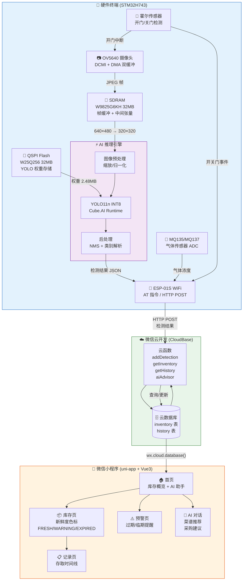

# 智能冰箱食材管理系统 — 模块间工作流程框图



## 工作流程说明

### 🚪 门开关 → 拍照 → AI 推理 → 上传

```
开门 → GPIO 中断 → 霍尔传感器检测
      ↓
  DCMI 启动 → OV5640 拍"开门前"照片 → SDRAM 帧缓冲
      ↓
  关门 → 再次拍照 → 两帧送入 AI 推理引擎
      ↓
  YOLO11n INT8 (QSPI 权重) → 检测食材类别 + 置信度 + 边界框
      ↓
  IoU 贪心匹配（前后帧对比）→ STILL / ADDED / REMOVED
      ↓
  ESP-01S HTTP POST → 云函数 addDetection → 写入云数据库
      ↓
  小程序实时刷新 → 库存更新 + 新鲜度重新计算
```

### 🫧 气体传感器 → 腐坏检测

```
MQ135/MQ137 定时采样 → ADC 读取 → 阈值判断
      ↓
  超出阈值 → HTTP POST 上报告警 → 云数据库写入
      ↓
  小程序预警页 → 红色标记 + 推送通知
```

### 🤖 AI 对话助手

```
用户在聊天页输入 → 云函数 aiAdvisor → DeepSeek API
      ↓                            ↓
  小程序展示回复        读取当前库存 + 历史记录作为上下文
  (菜谱/采购/分析)      返回自然语言回复
```
